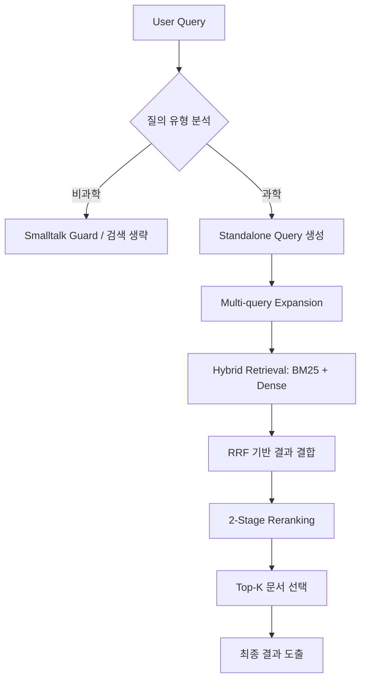

# 🚀 Science QA Retrieval System (RAG)

본 프로젝트는 **과학 상식 질의에 대해 신뢰도 높은 문서를 검색하고, 해당 문서만을 근거로 답변을 생성하는 RAG 기반 정보 검색(IR) 시스템** 구축 프로젝트입니다. 대화형 질의를 분석하여 검색 필요 여부를 판단하고, 색인된 문서 집합에서 가장 관련성이 높은 문서를 추출하는 최적의 파이프라인을 설계했습니다.

---

## 👥 Team (Search Spark 4조)

|  |  |  |  |  |  |
| :---: | :---: | :---: | :---: | :---: | :---: |
| **박준수** | **권문진** | **손은혜** | **이수민** | **권효주** | **허예경** |
| 팀장 · 모델설계 및 실험 | EDA · 모델 실험 | 모델설계 및 실험 | 모델설계 및 실험 | 모델설계 및 실험 | 모델설계 및 실험 |

---

## 📌 프로젝트 개요

### 🧭 프로젝트 소개
* **목표**: 과학 상식 질의에 대해 가장 관련성 높은 문서를 정확하게 검색하는 IR 파이프라인 설계
* **핵심 가치**: End-to-End 생성 성능보다 **Retrieval 정확도(MAP)**에 집중하여 질의 의도 판별 및 랭킹 후처리 로직 최적화

### 💻 개발 환경
* **Language**: Python 3.10
* **Search Engine**: Elasticsearch 8.x
* **Infra**: GPU (CUDA) / Local + Server 병행 개발
* **Libraries**: `torch`, `transformers`, `sentence-transformers`, `elasticsearch`, `numpy`, `pandas`

---

## 🏁 대회 정보

### 🧾 대회 개요
* **대회명**: Scientific Knowledge IR (RAG 기반 정보 검색 경진대회)
* **주최**: FAST CAMPUS
* **평가 지표**: **MAP@3 (Mean Average Precision at 3)**

### ⏱ 대회 일정
* **기간**: 2025.12.18 ~ 2025.12.29

---

## 📊 데이터 분석 및 전처리

### 🗂 데이터셋 개요
| 구분 | 상세 내용 |
| :--- | :--- |
| **문서 데이터** | 총 4,272개 (과학: 3,849개 / 비과학: 423개) |
| **질의 데이터** | 총 220개 (과학: 160개 / 비과학: 60개 - 인사, 자기소개 등 포함) |
| **분류 도구** | Solar-pro2 기반 `is_science` 및 `topic` 분류 수행 |

### 🔍 EDA 및 인사이트
* **분야 편중**: 문서 데이터가 생물, 물리, 지구과학 분야에 편중됨을 확인.
* **검색의 한계**: 'General Science' 문서 존재로 인해 단순 키워드 검색(Sparse)만으로는 변별력 확보가 어려움.
* **질의 다양성**: 비지식성 질의(Small Talk)가 다수 포함되어 있어 **Smalltalk Guard** 로직의 필요성 도출.

---

## 🤖 모델링 및 파이프라인

### 🧠 모델 및 기술 스택
* **Embedding 모델**:
    * `KURE-v1`: 한국어 과학 용어 특화 표현 학습.
    * `intfloat/multilingual-e5-large-instruct`: 다국어 대응 및 `query:`/`passage:` prefix 활용.
* **Retrieval 전략**:
    * **Multi-query**: original / expanded / conceptual query 생성.
    * **Hybrid Search**: BM25(Nori) + Dense Embedding (Dense : Sparse = 0.5 : 0.5).
    * **RRF (Reciprocal Rank Fusion)**: 검색 결과의 효과적인 통합.
* **Reranking**:
    * **Stage 1**: 후보군 필터링.
    * **Stage 2**: `BGE-reranker-v2-m3` 및 Fine-tuned Korean Reranker 앙상블을 통한 정밀 재정렬.

### ⚙ 주요 전략
1. **Query Builder**: Standalone Query 생성 프롬프트 고도화를 통해 대화 맥락 반영.
2. **모델 특성 반영**: E5 모델 전용 포맷 및 Cosine Similarity 적용.
3. **Recall 우선 전략**: 초기 후보군을 대폭 확장(`num_candidates` ≈ 3,000)하여 누락을 방지하고 Reranker로 Precision 확보.

---

## 🔄 시스템 아키텍처 (Pipeline)

---

## 🏆 결과 및 성과

### 📈 성능 지표 (Leader Board)
프롬프트 및 질의 이해 로직 개선과 하이브리드 검색 전략을 통해 초기 모델 대비 **약 21% 이상의 성능 향상**을 달성했습니다.

| 단계 | 주요 작업 내용 | MAP |
| :--- | :--- | :---: |
| **초기 설정** | Baseline (Basic Retrieval) | ~0.7470 |
| **Query 개선** | Prompt Engineering & Standalone Query | ~0.8727 |
| **최종 파이프라인** | **Hybrid Search + 2-Stage Reranker Ensemble** | **0.8970** |

* **발표 자료**: [Search Spark 4조 발표자료](https://docs.google.com/presentation/d/1WYHdQhw7ptXF1X_0bbvAIPcxq6Z7kkr7/edit?usp=sharing&ouid=117949632148545267959&rtpof=true&sd=true)

---

## 🧠 회고 및 인사이트

### ✨ 기술적 인사이트
* **질의 이해(Query Understanding)**: RAG 성능의 핵심 병목은 모델 체급 자체보다 질의를 어떻게 해석하고 변환(**Query Transformation**)하느냐에 달려 있음을 확인했습니다.
* **Recall vs Precision**: 충분한 후보군 확보(**Recall**)가 선행되지 않으면, 뒤단의 Reranker 성능이 아무리 뛰어나도 전체 성능 향상에 한계가 있음을 실증적으로 체감했습니다.
* **Hybrid Search**: 단순한 결과 결합이 아닌, 도메인 특성에 맞는 **조합 비율**과 **후처리 설계**가 최종 성능을 결정하는 핵심 요소임을 배웠습니다.

### 👥 What Went Well & Could Be Improved
* **성공 지점**: 문제를 단순 모델링이 아닌 **IR 시스템 설계 관점**에서 재정의하고, Retrieval / Reranking / Prompt 역할을 분리하여 실험 효율을 높인 것이 주효했습니다.
* **아쉬운 점**: 파이프라인 구조 고정이 다소 늦어졌으며, 초기에 정량적인 비교 기준에 대해 팀 내에서 더 충분한 합의가 선행되었다면 더 빠른 최적화가 가능했을 것이라는 교훈을 얻었습니다.

---

## 📚 References
* Lewis et al., 2020, *Retrieval-Augmented Generation*
* Karpukhin et al., 2020, *Dense Passage Retrieval*
* Cormack et al., 2009, *Reciprocal Rank Fusion*
* Shuster et al., 2021, *Standalone Question Generation*
* Upstage Tech Blog / Hugging Face Korea Blog
---
📫 **Contact**: 프로젝트 관련 문의는 이슈 또는 PR로 자유롭게 남겨주세요! 🙂
