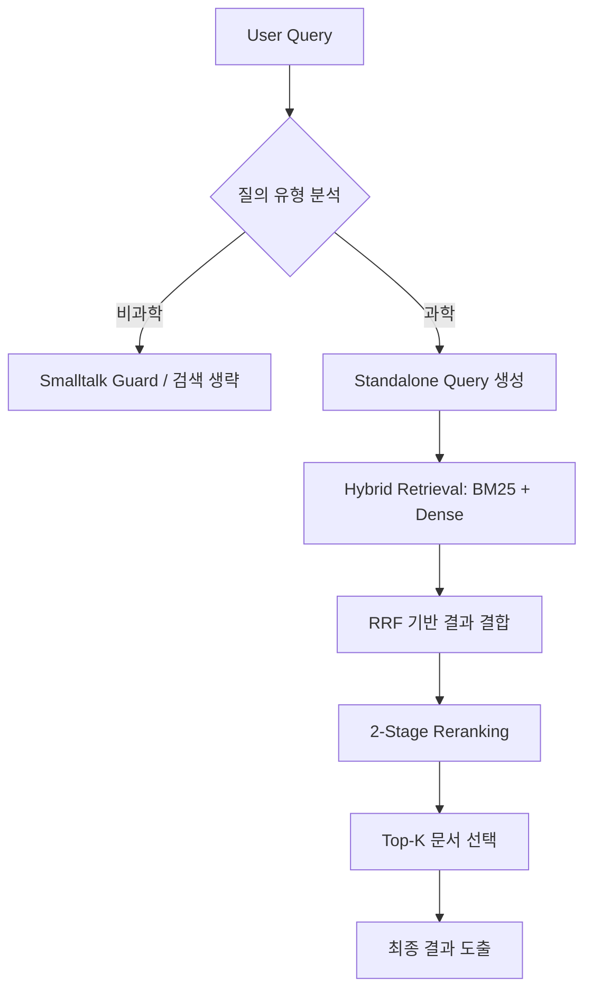

# 🚀 Science QA Retrieval System (RAG)

본 프로젝트는 과학 상식 질의 응답 시나리오를 가정한 **RAG 기반 정보 검색(IR) 시스템** 구축 프로젝트입니다. 대화형 질의를 분석하여 검색 필요 여부를 판단하고, 색인된 문서 집합에서 가장 관련성이 높은 문서를 추출하는 최적의 파이프라인을 설계했습니다.

---

## 📌 프로젝트 개요

### 🧭 프로젝트 소개
* **목표**: 과학 상식 질의에 대해 가장 관련성 높은 문서를 정확하게 검색하는 IR 파이프라인 설계
* **핵심 가치**: End-to-End 생성 성능보다 **Retrieval 정확도(MAP)**에 집중하여 질의 이해, 검색 전략, 랭킹 및 후처리 로직 최적화

### 💻 개발 환경
* **Language**: Python 3.10
* **Search Engine**: Elasticsearch 8.x
* **Infra**: GPU / CUDA 환경 (로컬 및 서버 병행)
* **Libraries**: `torch`, `transformers`, `sentence-transformers`, `elasticsearch`, `numpy`, `pandas`

---

## 🏁 대회 정보

### 🧾 대회 개요
* **대회명**: Scientific Knowledge Question Answering IR Seminar
* **주최**: FAST CAMPUS
* **문제 유형**: RAG 기반 정보 검색(IR)
* **평가 지표**: **MAP (Mean Average Precision)**

### ⏱ 대회 일정
* **기간**: 2025.12.18 ~ 2025.12.29

---

## 📊 데이터 분석 및 전처리

### 🗂 데이터셋 개요
| 구분 | 상세 내용 |
| :--- | :--- |
| **문서 데이터** | 총 4,272개 (과학: 3,849개 / 비과학: 423개) |
| **질의 데이터** | 과학 질의 및 비지식성 질의(인사, 감정 등) 포함 |
| **분석 기준** | `is_science` 및 `topic` 정보를 기반으로 분석 |

### 🔍 EDA 및 인사이트
* **분야 편중**: 문서 데이터가 생물, 물리, 지구과학 등 특정 과학 분야에 편중됨을 확인.
* **검색의 한계**: 'General Science' 키워드가 많아 단순 키워드 기반 검색(Sparse)만으로는 변별력 확보가 어려움.
* **질의 다양성**: Small Talk 성격의 비지식성 질의가 다수 존재하여 필터링 로직의 필요성 도출.
* ➡️ **결론**: 질의 유형 분기 로직 및 **Sparse + Dense Hybrid Retrieval** 구조 도입.

### 🧹 데이터 전처리 전략
* **LLM Classifier**: Solar 계열 모델을 활용해 문서/질의의 과학 여부 및 Topic 분류.
* **Smalltalk Guard**: 비지식성 질의에 대해 검색을 수행하지 않는 가드 로직을 적용하여 효율성 증대.

---

## 🤖 모델링 및 파이프라인

### 🧠 모델 및 기술 스택
* **Embedding 모델**:
    * `KURE-v1`: 한국어 과학 용어 특화 표현 학습 모델.
    * `intfloat/multilingual-e5-large-instruct`: 다국어 대응 및 질의-문서 의도 정합성 강화.
* **Retrieval 전략**:
    * **Sparse**: BM25 (Nori 형태소 분석기 활용)
    * **Dense**: Sentence-Transformers 기반 임베딩 검색
    * **Hybrid**: RRF(Reciprocal Rank Fusion)를 통한 결과 결합 (Weight 0.5 : 0.5)
* **Reranking**:
    * `BGE-reranker-v2-m3`를 활용한 2-Stage Reranking 수행.

### ⚙ 모델링 프로세스
1.  **Query Builder**: Standalone Query 생성 프롬프트를 통해 대화 맥락 반영 및 검색 쿼리 최적화.
2.  **Recall 확보**: 초기 후보군을 대폭 확장(`num_candidates` ≈ 3,000)하여 누락 방지.
3.  **Precision 최적화**: 고성능 Reranker를 통해 최종 순위 재정렬.

---

## 🔄 시스템 아키텍처 (Pipeline)

## 🏆 결과 및 성과

### 📈 성능 지표 (MAP Score)
단순 모델 교체가 아닌, **프롬프트 및 질의 이해 로직 개선**만으로 초기 모델 대비 약 **21%의 유의미한 성능 향상**을 달성했습니다.

| 단계 | 주요 작업 내용 | MAP |
| :--- | :--- | :---: |
| **초기 설정** | Baseline (Basic Retrieval) | ~0.74 |
| **Query 개선** | Prompt Engineering & Standalone Query | ~0.87 |
| **최종 파이프라인** | **Hybrid Search + 2-Stage Reranking** | **0.8970** |

---

## 🧠 회고 및 배운 점

### ✨ 기술적 인사이트
* **질의 이해(Query Understanding)**: RAG 성능의 핵심 병목은 모델 체급 자체보다 질의를 어떻게 해석하고 변환(**Query Transformation**)하느냐에 달려 있음을 확인했습니다.
* **Recall vs Precision**: 충분한 후보군 확보(**Recall**)가 선행되지 않으면, 뒤단의 Reranker 성능이 아무리 뛰어나도 전체 성능 향상에 한계가 있음을 체감했습니다.
* **Hybrid Search**: 단순한 결과 결합이 아닌, 데이터의 도메인 특성에 맞는 **조합 비율(Alpha)**과 후처리 전략이 최종 성능을 결정하는 핵심 요소임을 배웠습니다.

### 👥 협업 및 프로세스
* 문제를 단순히 "학습 모델 개발"로 국한하지 않고 **"검색 시스템 설계"** 관점에서 접근한 것이 빠른 성능 개선의 전환점이 되었습니다.
* 팀원 간의 실험 결과 공유와 빠른 피드백 루프가 복잡한 파이프라인 최적화 과정에서 결정적인 역할을 했습니다.

---

## 📫 Contact
* 프로젝트 관련 문의사항은 **Issue** 혹은 **Pull Request**로 자유롭게 남겨주세요! 🙂
